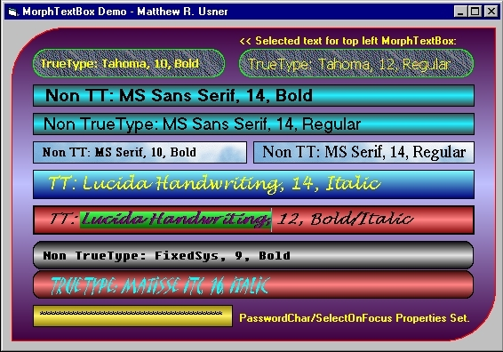



## MorphTextBox \(UNICODE BETA\) \- Ownerdrawn Single Line TextBox Control

### Description

(14 Apr 2007 - Added Unicode Beta code from Pietro Cecchi) A totally owner-drawn usercontrol that provides most of the functionality of VB's single-line textbox. It allows you to set the background as a gradient or a picture. Text color and selection color are also customizable. All the usual stuff is here - PasswordChar, Locked, etc. I have tried to emulate standard textbox keyboard and mouse control as closely as possible, but have not gone bonkers trying to exactly emulate everything. My point was to make a suitable replacement, one that can be used in place of the boring VB textbox. This is version 1, so I'm expecting that you'll find things that need fixed or improved. Known issues listed in source. Comments and votes welcome.
 
### More Info
 

             |
---                |---
**Submitted On**   |2007-04-14 16:15:06
**By**             |[Option Explicit](https://github.com/Planet-Source-Code/PSCIndex/blob/master/ByAuthor/option-explicit.md)
**Level**          |Intermediate
**User Rating**    |5.0 (320 globes from 64 users)
**Compatibility**  |VB 6\.0
**Category**       |[Custom Controls/ Forms/  Menus](https://github.com/Planet-Source-Code/PSCIndex/blob/master/ByCategory/custom-controls-forms-menus__1-4.md)
**World**          |[Visual Basic](https://github.com/Planet-Source-Code/PSCIndex/blob/master/ByWorld/visual-basic.md)
**Archive File**   |[MorphTextB2060254142007\.zip](https://github.com/Planet-Source-Code/option-explicit-morphtextbox-unicode-beta-ownerdrawn-single-line-textbox-control__1-60849/archive/master.zip)

